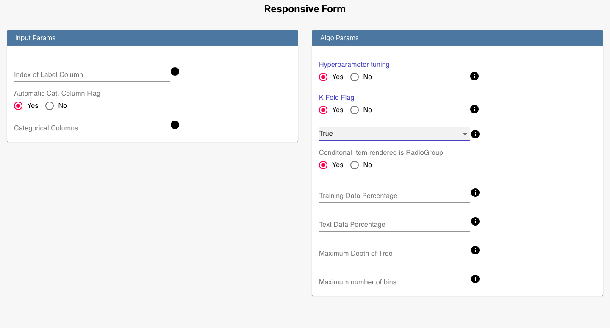

# Responsive Form

A simple responsive form made using react.

## Description

This is a reponsive form, done as part of a assignment. See the screenshot below.

All the components are picked from material UI library.
This application is also deployed on `Netlify` for sometime on https://dynamic-form-mohitk09.netlify.app/

## Running the service locally

1. Just type `yarn start`that will start the service on port 3000.
2. `yarn install` will the install the dependencies.
